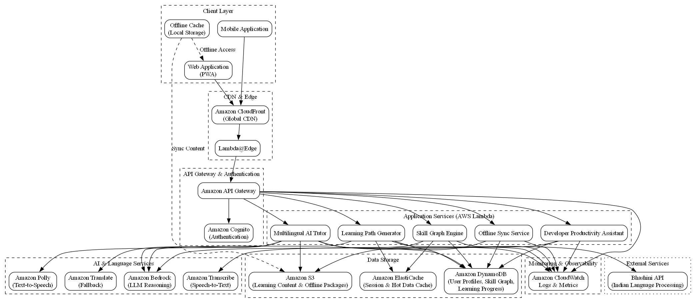
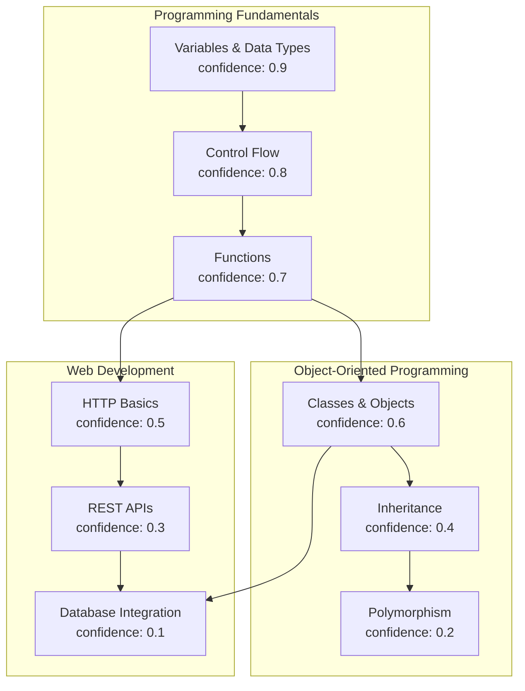
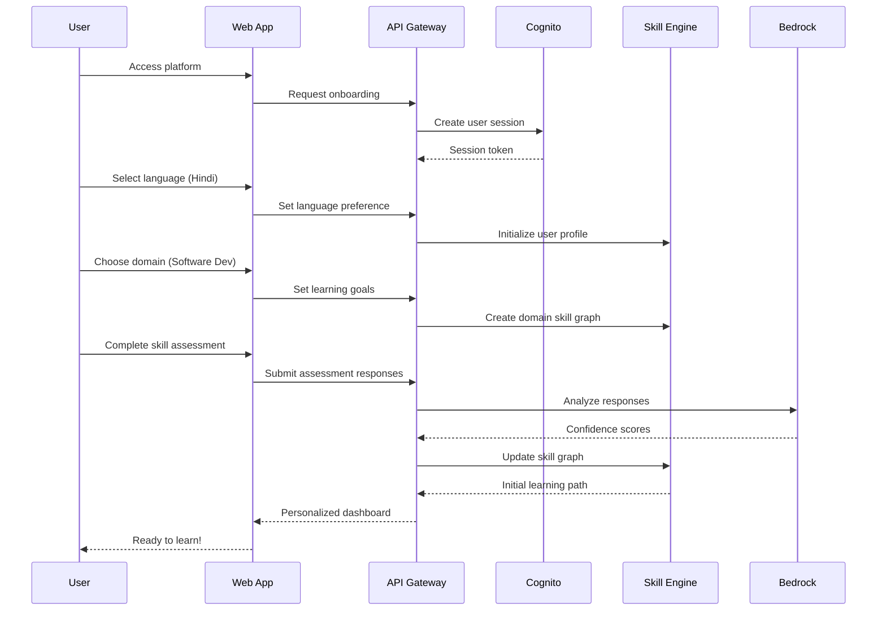
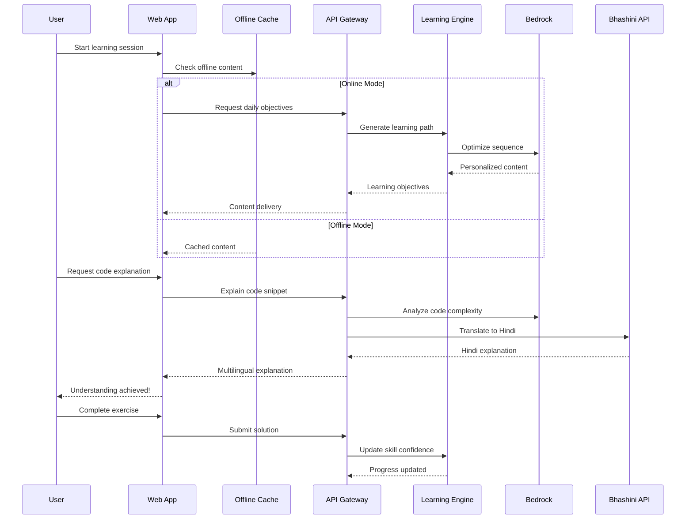
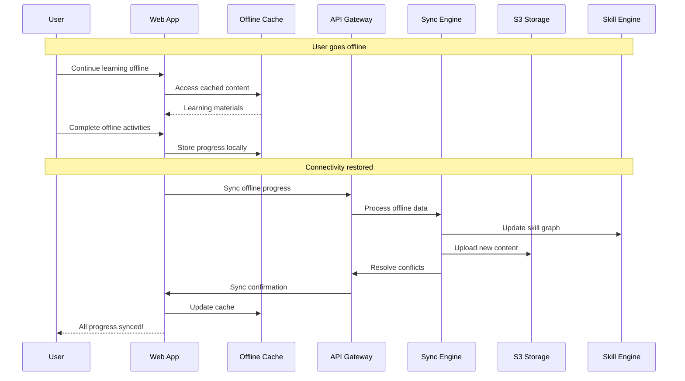

# Design Document: IndiLearn AI-Powered Learning Platform

## Overview

IndiLearn is a comprehensive AI-powered, multilingual learning and developer productivity platform specifically designed for Tier-2/3 Indian students and developers. The platform leverages advanced AI technologies to create personalized learning experiences through an innovative skill graph system, multilingual tutoring, and offline-first architecture optimized for Indian connectivity conditions.

### Core Innovation: AI-Driven Personal Skill Graph System

The platform's central innovation is an AI-powered skill graph that dynamically models each learner's knowledge state across multiple dimensions:
- **Knowledge Confidence**: Quantified understanding levels (0.0 to 1.0) for each skill node
- **Skill Dependencies**: Prerequisite relationships ensuring proper learning progression
- **Job Role Mapping**: Direct correlation between skills and real-world job requirements
- **Continuous Updates**: AI-driven confidence adjustments based on learning activities

This skill graph drives all personalization decisions, from learning path generation to explanation depth, making it fundamentally different from static curriculum-based approaches.

### Target Architecture Principles

1. **Offline-First**: Full functionality without internet connectivity
2. **Low-Bandwidth Optimized**: Efficient operation on 2G networks
3. **Multilingual Native**: Indian language support as a first-class feature
4. **AI-Driven Personalization**: Machine learning for adaptive learning experiences
5. **Scalable Infrastructure**: Support for millions of concurrent Indian learners
6. **Cost-Effective**: Optimized for Indian market economics

## Architecture

### High-Level AWS Architecture (MVP)



*Figure: High-level AWS architecture for IndiLearn MVP, showing client, edge, compute, AI, data, and monitoring layers.*


### Component Responsibilities

**Client Applications**:
- Web and mobile interfaces with offline capability
- Local caching and synchronization management
- Progressive Web App (PWA) for mobile-like experience

**CDN & Edge Layer**:
- Global content delivery through CloudFront
- Lambda@Edge for request routing and basic personalization
- Static asset optimization and compression

**API Gateway & Authentication**:
- RESTful API endpoints with rate limiting
- JWT-based authentication through Cognito
- Request validation and transformation

**Application Services**:
- Microservices architecture using Lambda functions
- Event-driven processing with SQS/SNS
- Stateless design for horizontal scalability

**AI Services Integration**:
- Amazon Bedrock for LLM inference and reasoning
- Bhashini API for Indian language processing
- Amazon Translate for fallback translation
- Polly/Transcribe for speech capabilities

**Data Storage**:
- DynamoDB for skill graphs and user progress
- S3 for learning content and offline packages
- ElastiCache for session and frequently accessed data

## INPUT → AI PROCESS → OUTPUT Pipeline

### Core AI Processing Pipeline

The IndiLearn platform processes multiple types of inputs through sophisticated AI pipelines to generate personalized learning experiences:

#### 1. Skill Assessment Pipeline

**INPUT**:
- User responses to assessment questions
- Code submissions and debugging attempts
- Learning activity completion data
- Time spent on concepts and error patterns

**AI PROCESS**:
1. **Multi-Signal Analysis**: Amazon Bedrock processes assessment responses using Claude-3 to infer understanding depth
2. **Confidence Scoring**: ML models calculate confidence weights (0.0-1.0) for each skill node
3. **Dependency Mapping**: AI reasoning determines prerequisite relationships and knowledge gaps
4. **Bayesian Updates**: Continuous confidence adjustment based on new learning evidence

**OUTPUT**:
- Updated skill graph with confidence weights
- Identified knowledge gaps and strengths
- Prerequisite recommendations
- Job readiness scores for target roles

#### 2. Learning Path Generation Pipeline

**INPUT**:
- Current skill graph state
- Learning objectives and time constraints
- User preferences and learning style indicators
- Historical learning velocity data

**AI PROCESS**:
1. **Optimization Algorithm**: Bedrock uses advanced reasoning to optimize learning sequences
2. **Difficulty Adaptation**: AI adjusts content complexity based on skill confidence levels
3. **Engagement Prediction**: ML models predict optimal content types and pacing
4. **Multi-Objective Balancing**: AI balances learning efficiency, retention, and engagement

**OUTPUT**:
- Personalized daily learning objectives
- Adaptive content sequences (concept→practice→application)
- Difficulty-adjusted exercises and projects
- Estimated completion timelines

#### 3. Multilingual Explanation Pipeline

**INPUT**:
- Code snippets, error messages, or technical concepts
- User's preferred language and current skill level
- Context from current learning session
- Cultural and regional preferences

**AI PROCESS**:
1. **Content Analysis**: Bedrock analyzes technical content complexity and key concepts
2. **Language Processing**: Bhashini API handles Indian language nuances and cultural context
3. **Explanation Generation**: AI generates explanations at appropriate depth for skill level
4. **Cultural Adaptation**: Content adapted for Indian context with relevant examples

**OUTPUT**:
- Line-by-line code explanations in local languages
- Error message translations with debugging guidance
- Concept explanations with Indian context examples
- Interactive Q&A for clarification

#### 4. Developer Productivity Pipeline

**INPUT**:
- Real-time code being written
- Error logs and debugging sessions
- Development environment context
- Security scanning results

**AI PROCESS**:
1. **Code Analysis**: Static analysis combined with AI pattern recognition
2. **Error Diagnosis**: Bedrock analyzes error patterns and suggests solutions
3. **Security Assessment**: AI identifies vulnerabilities and suggests secure alternatives
4. **Best Practice Recommendations**: ML models suggest improvements based on industry standards

**OUTPUT**:
- Real-time code quality suggestions
- Debugging guidance in user's preferred language
- Security vulnerability alerts with fixes
- Performance optimization recommendations

#### 5. Offline Synchronization Pipeline

**INPUT**:
- Offline learning activities and progress
- Cached content usage patterns
- Network connectivity status
- Device storage constraints

**AI PROCESS**:
1. **Conflict Resolution**: AI resolves data conflicts from offline activities
2. **Priority Scoring**: ML models determine content caching priorities
3. **Sync Optimization**: AI optimizes data transfer for limited bandwidth
4. **Progress Reconciliation**: Skill graph updates merged intelligently

**OUTPUT**:
- Synchronized skill graph updates
- Optimized content cache refresh
- Resolved learning progress conflicts
- Updated offline content packages

## AWS Cloud Architecture

### Detailed AWS Service Architecture

```mermaid
graph TB
    subgraph "Global Edge Network"
        CF[CloudFront Distribution]
        EDGE[Lambda@Edge Functions]
        WAF[AWS WAF]
    end
    
    subgraph "Mumbai Region (ap-south-1)"
        subgraph "API Layer"
            APIGW[API Gateway]
            COGNITO[Cognito User Pools]
            CERT[Certificate Manager]
        end
        
        subgraph "Compute Layer"
            LAMBDA_SKILL[Lambda: Skill Graph]
            LAMBDA_LEARN[Lambda: Learning Path]
            LAMBDA_TUTOR[Lambda: AI Tutor]
            LAMBDA_SYNC[Lambda: Offline Sync]
            LAMBDA_AUTH[Lambda: Authentication]
        end
        
        subgraph "AI/ML Services"
            BEDROCK[Amazon Bedrock]
            TRANSLATE[Amazon Translate]
            POLLY[Amazon Polly - Indian Voices]
            TRANSCRIBE[Amazon Transcribe]
            COMPREHEND[Amazon Comprehend]
        end
        
        subgraph "Data Storage"
            DYNAMO_USERS[DynamoDB: Users]
            DYNAMO_SKILLS[DynamoDB: Skill Graphs]
            DYNAMO_PROGRESS[DynamoDB: Learning Progress]
            S3_CONTENT[S3: Learning Content]
            S3_OFFLINE[S3: Offline Packages]
            ELASTICACHE[ElastiCache: Sessions]
        end
        
        subgraph "Integration & Messaging"
            SQS[SQS: Task Queues]
            SNS[SNS: Notifications]
            EVENTBRIDGE[EventBridge: Events]
        end
        
        subgraph "Monitoring & Security"
            CLOUDWATCH[CloudWatch Logs/Metrics]
            XRAY[X-Ray Tracing]
            IAM[IAM Roles & Policies]
            SECRETS[Secrets Manager]
        end
    end
    
    subgraph "External Services"
        BHASHINI[Bhashini API]
        PAYMENT[Payment Gateway]
    end
    
    CF --> APIGW
    EDGE --> LAMBDA_AUTH
    APIGW --> COGNITO
    APIGW --> LAMBDA_SKILL
    APIGW --> LAMBDA_LEARN
    APIGW --> LAMBDA_TUTOR
    APIGW --> LAMBDA_SYNC
    
    LAMBDA_SKILL --> BEDROCK
    LAMBDA_LEARN --> BEDROCK
    LAMBDA_TUTOR --> BEDROCK
    LAMBDA_TUTOR --> BHASHINI
    LAMBDA_TUTOR --> TRANSLATE
    LAMBDA_TUTOR --> POLLY
    
    LAMBDA_SKILL --> DYNAMO_SKILLS
    LAMBDA_LEARN --> DYNAMO_PROGRESS
    LAMBDA_AUTH --> DYNAMO_USERS
    LAMBDA_SYNC --> S3_OFFLINE
    
    LAMBDA_SKILL --> SQS
    SQS --> SNS
    EVENTBRIDGE --> LAMBDA_SYNC
```

### AWS Service Justifications

#### Amazon Bedrock
**Purpose**: Core AI inference for skill reasoning, learning path optimization, and multilingual explanations
**Justification**: 
- Provides access to state-of-the-art LLMs (Claude-3, Llama-2) without infrastructure management
- Token-based pricing model suitable for educational platform economics
- Built-in safety features and content filtering for educational content
- Regional availability in Mumbai (ap-south-1) for low latency to Indian users
- Batch inference capabilities for cost optimization during off-peak hours

#### Amazon DynamoDB
**Purpose**: Primary database for skill graphs, user progress, and real-time data
**Justification**:
- Single-digit millisecond latency required for skill graph updates
- Automatic scaling to handle millions of concurrent Indian learners
- Global tables for multi-region deployment if needed
- Point-in-time recovery for critical learning progress data
- Cost-effective for read-heavy workloads with on-demand pricing

#### Amazon S3 + CloudFront
**Purpose**: Learning content storage and global delivery
**Justification**:
- S3 provides unlimited storage for multimedia learning content
- CloudFront edge locations in India (Mumbai, Chennai, New Delhi) for low latency
- Intelligent tiering for cost optimization of learning materials
- Transfer acceleration for content uploads from Indian regions
- Origin Access Control for secure content delivery

#### AWS Lambda
**Purpose**: Serverless compute for all application logic
**Justification**:
- Pay-per-request pricing ideal for variable educational workloads
- Automatic scaling during peak learning hours (evenings in India)
- No server management overhead for rapid development
- Native integration with all AWS AI services
- Cold start optimization with provisioned concurrency for critical functions

#### Amazon Translate + Bhashini API Integration
**Purpose**: Multilingual support for Indian languages
**Justification**:
- Amazon Translate provides baseline translation capabilities
- Bhashini API offers superior Indian language processing and cultural context
- Hybrid approach ensures fallback when Bhashini is unavailable
- Cost optimization by using Bhashini for primary languages, Translate for others

#### Amazon Polly (Indian Voices)
**Purpose**: Text-to-speech for accessibility and audio learning
**Justification**:
- Native support for Indian English accents and pronunciation
- Hindi voice support with natural intonation
- SSML support for educational content emphasis
- Streaming audio for bandwidth optimization
- Pay-per-character pricing suitable for educational content

### Regional Deployment Strategy

**Primary Region**: Mumbai (ap-south-1)
- Lowest latency for majority of Indian users
- Full service availability including Bedrock
- Data residency compliance for Indian users
- Cost optimization for data transfer within region

**Edge Locations**: 
- Mumbai, Chennai, New Delhi CloudFront POPs
- Lambda@Edge for request routing and basic personalization
- Cached content delivery for offline package downloads

**Backup Strategy**:
- Singapore (ap-southeast-1) as secondary region
- Cross-region replication for critical data
- Disaster recovery with RTO < 4 hours

## AI Skill Graph Design

### Skill Node Structure

Each skill in the AI skill graph is represented as a comprehensive node containing:

```json
{
  "skillId": "python-functions-basic",
  "domain": "software-development",
  "title": "Python Function Basics",
  "description": "Understanding function definition, parameters, and return values",
  "confidence": 0.75,
  "lastUpdated": "2024-01-15T10:30:00Z",
  "prerequisites": ["python-variables", "python-control-flow"],
  "dependents": ["python-functions-advanced", "python-modules"],
  "jobRoles": {
    "python-developer": 0.8,
    "backend-developer": 0.6,
    "data-scientist": 0.4
  },
  "learningEvidence": [
    {
      "type": "assessment",
      "score": 0.8,
      "timestamp": "2024-01-15T09:15:00Z",
      "weight": 0.3
    },
    {
      "type": "code-submission",
      "success": true,
      "attempts": 2,
      "timestamp": "2024-01-15T10:20:00Z",
      "weight": 0.5
    }
  ],
  "culturalContext": {
    "examples": ["Indian e-commerce scenarios", "Government form processing"],
    "localizations": {
      "hi": "पायथन फ़ंक्शन की मूल बातें",
      "ta": "பைதான் செயல்பாட்டின் அடிப்படைகள்"
    }
  }
}
```

### Confidence Weight Calculation

The AI system calculates confidence weights using a sophisticated Bayesian approach:

**Base Formula**:
```
confidence = Σ(evidence_i × weight_i × recency_factor_i) / Σ(weight_i)
```

**Evidence Types and Weights**:
- Assessment responses: 0.3
- Code submissions: 0.5
- Debugging success: 0.4
- Peer explanations: 0.2
- Time-to-completion: 0.1

**Recency Factor**:
```
recency_factor = e^(-λ × days_since_evidence)
```
Where λ = 0.1 (decay constant)

### Sample Skill Graph Structure



### Job Role Mapping

Each skill node maintains relevance scores for different job roles:

**Software Developer Role**:
- Python Functions: 0.8 relevance
- Database Integration: 0.9 relevance
- Algorithm Design: 0.7 relevance

**AI/ML Engineer Role**:
- Python Functions: 0.9 relevance
- Statistics: 0.8 relevance
- Neural Networks: 0.9 relevance

**Job Readiness Calculation**:
```
job_readiness = Σ(skill_confidence × role_relevance × skill_weight) / total_role_requirements
```

## User Flow Diagrams

### Onboarding Flow



### Learning Session Flow



### Offline Synchronization Flow



## Data Models

### User Profile Schema

```json
{
  "userId": "user_12345",
  "email": "student@example.com",
  "profile": {
    "name": "Rahul Sharma",
    "preferredLanguage": "hi",
    "location": {
      "city": "Indore",
      "state": "Madhya Pradesh",
      "tier": "2"
    },
    "connectivity": {
      "type": "2G",
      "reliability": "intermittent"
    },
    "learningGoals": ["software-development", "web-development"],
    "targetRoles": ["full-stack-developer", "backend-developer"],
    "availableTime": {
      "dailyMinutes": 120,
      "preferredHours": ["19:00-21:00"]
    }
  },
  "preferences": {
    "explanationDepth": "detailed",
    "codeExamples": "indian-context",
    "audioEnabled": true,
    "offlineMode": true
  },
  "subscription": {
    "plan": "free",
    "features": ["basic-ai-tutor", "offline-content"],
    "expiresAt": "2024-12-31T23:59:59Z"
  },
  "createdAt": "2024-01-01T00:00:00Z",
  "lastActiveAt": "2024-01-15T10:30:00Z"
}
```

### Skill Graph Schema

```json
{
  "userId": "user_12345",
  "domain": "software-development",
  "skillGraph": {
    "nodes": {
      "python-variables": {
        "confidence": 0.9,
        "lastUpdated": "2024-01-15T10:30:00Z",
        "prerequisites": [],
        "dependents": ["python-functions", "python-loops"],
        "jobRelevance": {
          "python-developer": 0.8,
          "data-scientist": 0.7
        }
      },
      "python-functions": {
        "confidence": 0.7,
        "lastUpdated": "2024-01-15T09:15:00Z",
        "prerequisites": ["python-variables"],
        "dependents": ["python-classes", "python-modules"],
        "jobRelevance": {
          "python-developer": 0.9,
          "backend-developer": 0.8
        }
      }
    },
    "edges": [
      {
        "from": "python-variables",
        "to": "python-functions",
        "strength": 0.8,
        "type": "prerequisite"
      }
    ]
  },
  "jobReadiness": {
    "python-developer": 0.65,
    "backend-developer": 0.45,
    "full-stack-developer": 0.30
  },
  "lastCalculated": "2024-01-15T10:30:00Z",
  "version": "1.2.3"
}
```

### Learning Progress Schema

```json
{
  "userId": "user_12345",
  "sessionId": "session_67890",
  "date": "2024-01-15",
  "activities": [
    {
      "activityId": "activity_001",
      "type": "concept-learning",
      "skillId": "python-functions",
      "startTime": "2024-01-15T09:00:00Z",
      "endTime": "2024-01-15T09:30:00Z",
      "completed": true,
      "score": 0.85,
      "attempts": 1,
      "hintsUsed": 2,
      "language": "hi"
    },
    {
      "activityId": "activity_002",
      "type": "code-practice",
      "skillId": "python-functions",
      "startTime": "2024-01-15T09:30:00Z",
      "endTime": "2024-01-15T10:15:00Z",
      "completed": true,
      "codeSubmissions": [
        {
          "code": "def greet(name):\n    return f'Hello {name}'",
          "result": "success",
          "timestamp": "2024-01-15T10:10:00Z"
        }
      ],
      "aiAssistanceUsed": [
        {
          "type": "explanation",
          "content": "Function definition in Hindi",
          "timestamp": "2024-01-15T09:45:00Z"
        }
      ]
    }
  ],
  "dailyStats": {
    "totalTimeMinutes": 75,
    "skillsImproved": ["python-functions"],
    "confidenceGains": {
      "python-functions": 0.15
    },
    "streakDays": 5
  },
  "offlineSync": {
    "lastSyncTime": "2024-01-15T10:30:00Z",
    "pendingActivities": 0,
    "conflictsResolved": []
  }
}
```

### Offline Cache Schema

```json
{
  "userId": "user_12345",
  "cacheVersion": "1.0.0",
  "lastUpdated": "2024-01-15T08:00:00Z",
  "storageUsed": "45MB",
  "storageLimit": "100MB",
  "content": {
    "learningPaths": [
      {
        "pathId": "python-basics-week1",
        "priority": "high",
        "size": "15MB",
        "activities": ["activity_001", "activity_002", "activity_003"],
        "downloadedAt": "2024-01-15T08:00:00Z",
        "expiresAt": "2024-01-22T08:00:00Z"
      }
    ],
    "aiModels": {
      "explanationModel": {
        "modelId": "lightweight-explainer-v1",
        "size": "20MB",
        "languages": ["hi", "en"],
        "capabilities": ["code-explanation", "error-debugging"]
      }
    },
    "multimedia": [
      {
        "contentId": "video_python_functions_hi",
        "type": "video",
        "language": "hi",
        "size": "8MB",
        "duration": "10:30",
        "quality": "480p"
      }
    ]
  },
  "syncQueue": {
    "pendingUploads": [],
    "pendingDownloads": [
      {
        "contentId": "next-week-content",
        "priority": "medium",
        "estimatedSize": "12MB"
      }
    ]
  }
}
```

## Offline & Low-Bandwidth Design

### Cache Strategy

**Intelligent Content Prioritization**:
1. **Current Learning Path**: Highest priority, always cached
2. **Prerequisite Skills**: Medium priority, cached if space available
3. **Advanced Topics**: Low priority, cached only with abundant storage
4. **Multimedia Content**: Adaptive quality based on bandwidth

**Cache Management Algorithm**:
```python
def optimize_cache(user_profile, available_storage, learning_path):
    priority_score = calculate_priority(
        current_progress=user_profile.skill_graph,
        learning_velocity=user_profile.learning_stats,
        upcoming_activities=learning_path.next_week
    )
    
    content_selection = select_content(
        priority_scores=priority_score,
        storage_constraint=available_storage,
        user_preferences=user_profile.preferences
    )
    
    return optimized_cache_package
```

### Sync Triggers and Conflict Resolution

**Sync Triggers**:
- Network connectivity restored
- Daily sync schedule (if online)
- Manual sync request
- Critical progress milestones reached
- Cache storage threshold exceeded

**Conflict Resolution Strategy**:
1. **Skill Confidence**: Use maximum confidence value (learning is additive)
2. **Learning Progress**: Merge activity logs chronologically
3. **User Preferences**: Server version takes precedence
4. **Content Updates**: Latest timestamp wins

**Bandwidth Optimization**:
- Delta sync for skill graph updates
- Compressed JSON for data transfer
- Progressive image loading
- Adaptive video quality (240p for 2G, 480p for 3G+)

### Offline AI Processing

**Local AI Capabilities**:
- Lightweight explanation models (20MB)
- Basic code analysis and syntax checking
- Simple skill confidence updates
- Offline progress tracking

**Hybrid Processing**:
- Complex AI reasoning deferred to online mode
- Local models handle 80% of common queries
- Graceful degradation when advanced AI unavailable
- Queue complex requests for online processing

## Security & Privacy Design

### Data Minimization Strategy

**Collected Data**:
- Essential: Learning progress, skill assessments, language preferences
- Optional: Location (city-level only), device capabilities
- Never Collected: Personal conversations, sensitive personal information

**Data Retention**:
- Active users: Indefinite retention for personalization
- Inactive users (>1 year): Anonymized aggregation only
- Deleted accounts: Complete data removal within 30 days

### Encryption and Security

**Data in Transit**:
- TLS 1.3 for all API communications
- Certificate pinning for mobile applications
- End-to-end encryption for sensitive operations

**Data at Rest**:
- DynamoDB encryption with customer-managed keys
- S3 server-side encryption with KMS
- ElastiCache encryption for session data

**Access Control**:
- IAM roles with least privilege principle
- Multi-factor authentication for admin access
- API rate limiting and DDoS protection via WAF

### Privacy Controls

**User Rights**:
- View all personal data (GDPR Article 15)
- Correct inaccurate information (GDPR Article 16)
- Delete account and data (GDPR Article 17)
- Data portability in JSON format (GDPR Article 20)

**Consent Management**:
- Granular consent for different data uses
- Easy withdrawal of consent
- Clear privacy policy in local languages
- Regular consent renewal prompts

### AI Safety and Bias Mitigation

**Bias Detection**:
- Regular audits of AI recommendations across demographic groups
- A/B testing for fairness in learning path generation
- Monitoring for regional or linguistic bias in explanations

**Content Safety**:
- Automated content filtering for inappropriate material
- Human review for culturally sensitive content
- Community reporting mechanisms

**Transparency**:
- Clear explanation of AI decision-making
- User control over AI assistance levels
- Open documentation of AI capabilities and limitations

## MVP Deployment Strategy

### Hackathon Scope Definition

**Included Features**:
1. User onboarding with Hindi/English language selection
2. Basic skill assessment for Python programming
3. AI-powered skill graph with 20 core programming skills
4. Personalized learning path generation
5. Multilingual code explanations (Hindi + English)
6. Offline content caching simulation
7. Progress dashboard with job readiness scoring
8. Basic developer productivity features (code analysis)

**Excluded from MVP**:
- Full mobile application (PWA only)
- Complete offline synchronization
- Advanced AI tutoring features
- Payment integration
- Multi-domain support (Python only)
- Advanced analytics and reporting

### AWS Cost Control for Hackathon

**Service Limits**:
- Lambda: 1M requests/month (free tier)
- DynamoDB: 25GB storage, 200M requests/month (free tier)
- S3: 5GB storage, 20K GET requests (free tier)
- Bedrock: $100 budget limit with CloudWatch alarms
- API Gateway: 1M requests/month (free tier)

**Cost Optimization**:
- Use Bedrock batch inference for non-real-time processing
- Implement aggressive caching to minimize AI API calls
- Use S3 Intelligent Tiering for content storage
- Set up billing alerts at $50 and $75 thresholds

### Demo Preparation

**Demo Scenarios**:
1. **New User Onboarding**: Show language selection and skill assessment
2. **Personalized Learning**: Demonstrate adaptive learning path generation
3. **AI Tutoring**: Show code explanation in Hindi with cultural context
4. **Offline Capability**: Simulate offline learning and sync
5. **Progress Tracking**: Display skill graph and job readiness scores

**Performance Targets**:
- Page load time: <3 seconds on 3G
- AI response time: <5 seconds for explanations
- Offline functionality: 100% feature parity for cached content
- Concurrent users: Support 100 simultaneous demo users

## Limitations & Future Roadmap

### Current Limitations

**Technical Constraints**:
- Limited to Python programming domain for MVP
- Basic offline AI processing capabilities
- Simplified skill graph with 20 core skills
- Hindi and English languages only initially

**Infrastructure Limitations**:
- Single AWS region deployment (Mumbai)
- Basic disaster recovery capabilities
- Limited real-time collaboration features
- Simplified payment integration

**AI Model Limitations**:
- Dependency on external AI services (Bedrock, Bhashini)
- Limited fine-tuning for Indian educational context
- Basic bias detection and mitigation
- Simplified cultural adaptation algorithms

### Future Roadmap

**Phase 2 (3-6 months)**:
- Expand to Java, JavaScript, and C++ programming domains
- Add Tamil, Telugu, and Marathi language support
- Implement advanced offline synchronization
- Deploy mobile applications (iOS/Android)
- Add peer learning and collaboration features

**Phase 3 (6-12 months)**:
- AI/ML and Data Science learning domains
- Advanced AI tutoring with voice interaction
- Integration with popular IDEs and development tools
- Corporate training and institutional partnerships
- Advanced analytics and learning insights

**Phase 4 (12+ months)**:
- Cloud & DevOps and Cybersecurity domains
- Multi-region deployment across India
- Advanced AI model fine-tuning for Indian context
- Integration with job placement platforms
- Certification and accreditation programs

### Scalability Considerations

**User Growth Projections**:
- Year 1: 100K registered users, 10K daily active users
- Year 2: 1M registered users, 100K daily active users
- Year 3: 5M registered users, 500K daily active users

**Infrastructure Scaling Plan**:
- Auto-scaling Lambda functions with provisioned concurrency
- DynamoDB on-demand scaling with global tables
- Multi-region CloudFront distribution
- Advanced caching strategies with ElastiCache clusters
- Microservices architecture with container orchestration

**Cost Optimization Strategy**:
- Reserved capacity for predictable workloads
- Spot instances for batch processing
- Intelligent content delivery optimization
- AI model optimization and caching
- Tiered pricing model for premium features

## Correctness Properties

*A property is a characteristic or behavior that should hold true across all valid executions of a system-essentially, a formal statement about what the system should do. Properties serve as the bridge between human-readable specifications and machine-verifiable correctness guarantees.*

### Property Reflection

After analyzing all acceptance criteria, I identified several areas where properties could be consolidated to eliminate redundancy:

- **Language Persistence Properties**: Requirements 1.2 and 4.1 both deal with language preference consistency - combined into one comprehensive property
- **Skill Graph Update Properties**: Requirements 2.2, 2.5, and 5.5 all involve skill graph updates - consolidated into properties that cover the complete update cycle
- **AI Explanation Properties**: Requirements 4.1, 4.3, and 4.5 all relate to AI explanation generation - combined into comprehensive explanation properties
- **Cache Management Properties**: Requirements 6.1, 6.4, and 6.5 all deal with caching behavior - consolidated into unified cache management properties
- **Progress Tracking Properties**: Requirements 7.3, 7.4, and 7.5 all involve progress calculation and display - combined where logical overlap exists

### Core Correctness Properties

#### Property 1: Language Preference Consistency
*For any* user language selection, once set, all subsequent platform interactions should consistently use that language for UI elements, AI explanations, and content delivery until explicitly changed by the user.
**Validates: Requirements 1.2, 4.1**

#### Property 2: Skill Graph Confidence Bounds
*For any* skill node in the AI skill graph, the confidence weight must always remain within the valid range of 0.0 to 1.0, regardless of learning activities or updates performed.
**Validates: Requirements 2.1**

#### Property 3: Skill Dependency Enforcement
*For any* skill with prerequisites, the system should prevent access to advanced topics until all prerequisite skills have confidence weights above the minimum threshold (typically 0.7).
**Validates: Requirements 2.3**

#### Property 4: Job Role Mapping Completeness
*For any* skill in the system, there must exist at least one job role mapping with a relevance score, ensuring all skills contribute to career readiness assessment.
**Validates: Requirements 2.4**

#### Property 5: Skill Graph Update Propagation
*For any* completed learning activity, the system should update relevant skill confidence weights and trigger recalculation of all affected job readiness scores within the same transaction.
**Validates: Requirements 2.2, 2.5, 5.5**

#### Property 6: Learning Path Structure Invariant
*For any* generated learning path, the sequence should follow the concept→practice→application pattern, with each phase building upon the previous one.
**Validates: Requirements 3.4**

#### Property 7: Adaptive Difficulty Adjustment
*For any* learning session where struggle or quick mastery is detected, the system should adjust subsequent content difficulty appropriately - increasing foundational content for struggle, advancing complexity for mastery.
**Validates: Requirements 3.2, 3.3**

#### Property 8: Learning Path Prioritization
*For any* generated learning path, skills with higher impact scores for the user's target job role should appear earlier in the sequence than lower-impact skills.
**Validates: Requirements 3.5**

#### Property 9: Multilingual Explanation Completeness
*For any* code snippet, error message, or concept explanation request, the AI tutor should provide a complete explanation in the user's preferred language that includes relevant examples from Indian cultural context.
**Validates: Requirements 4.1, 4.2, 4.5**

#### Property 10: Explanation Depth Adaptation
*For any* concept explanation request, the depth and complexity of the explanation should correlate with the user's current confidence level for related skills - more detailed for low confidence, more concise for high confidence.
**Validates: Requirements 4.3**

#### Property 11: Real-time Code Analysis
*For any* code input during development, the system should provide immediate feedback including quality suggestions, security vulnerability detection, and best practice recommendations.
**Validates: Requirements 5.1, 5.3**

#### Property 12: Error Analysis and Debugging
*For any* debugging error encountered, the system should analyze the error pattern and provide specific debugging steps in the user's preferred language.
**Validates: Requirements 5.2**

#### Property 13: Offline Content Availability
*For any* learning path content marked as high priority, when internet connectivity is available, the content should be pre-cached and remain accessible during offline periods.
**Validates: Requirements 6.1, 6.2**

#### Property 14: Offline-Online Synchronization
*For any* learning progress made while offline, when connectivity is restored, all progress data, skill graph updates, and completed activities should be synchronized to the cloud without data loss.
**Validates: Requirements 6.3**

#### Property 15: Cache Priority Management
*For any* content caching decision under storage constraints, higher priority content (current learning path) should be preserved over lower priority content (future or optional materials).
**Validates: Requirements 6.4, 6.5**

#### Property 16: Progress Milestone Recognition
*For any* significant learning milestone reached (skill mastery, module completion, confidence threshold), the system should provide appropriate achievement recognition and suggest next-level goals.
**Validates: Requirements 7.2, 7.4**

#### Property 17: Job Readiness Calculation Accuracy
*For any* skill graph state, the calculated job readiness scores should accurately reflect the weighted combination of skill confidence levels and their relevance to specific job roles.
**Validates: Requirements 7.3**

#### Property 18: Learning Velocity Tracking
*For any* user's learning activities over time, the system should calculate and display learning velocity trends and provide realistic projected timelines for role readiness achievement.
**Validates: Requirements 7.5**

#### Property 19: AI Inference Caching
*For any* repeated AI inference request with identical inputs, the system should return cached results rather than making new API calls, reducing costs and improving response times.
**Validates: Requirements 8.5**

#### Property 20: Bandwidth-Adaptive Content Delivery
*For any* detected low-bandwidth condition, the system should prioritize essential learning content and defer non-critical resources like high-resolution images or videos.
**Validates: Requirements 9.2**

#### Property 21: Accessibility Content Completeness
*For any* visual content element in the platform, there should exist appropriate text alternatives that convey the same information for screen readers and accessibility tools.
**Validates: Requirements 9.4**

#### Property 22: Accessibility Feature Preservation
*For any* accessibility feature enabled (high contrast, screen reader mode), all core learning functionality should remain fully operational without degraded user experience.
**Validates: Requirements 9.5**

#### Property 23: Data Collection Minimization
*For any* user interaction with the platform, only data explicitly required for personalized learning functionality should be collected, with clear user consent for each data type.
**Validates: Requirements 10.1**

#### Property 24: Data Encryption Consistency
*For any* personal data processed by the system, both data in transit and data at rest should be encrypted using industry-standard encryption methods.
**Validates: Requirements 10.2**

#### Property 25: Privacy Control Accessibility
*For any* user account, privacy controls for viewing, modifying, and deleting personal data should be easily accessible and fully functional.
**Validates: Requirements 10.3**

#### Property 26: AI Privacy Protection
*For any* AI inference operation, sensitive personal information should be filtered out before sending requests to external AI services.
**Validates: Requirements 10.5**

#### Property 27: Multi-Signal Confidence Assessment
*For any* skill confidence calculation, the AI system should consider multiple learning signals (assessments, code submissions, time-to-completion, error patterns) rather than relying on single metrics.
**Validates: Requirements 11.2**

#### Property 28: Knowledge-Adaptive AI Explanations
*For any* AI-generated explanation, the content complexity and depth should adapt to the learner's current knowledge level as reflected in their skill graph confidence scores.
**Validates: Requirements 11.3**

#### Property 29: AI-Optimized Learning Paths
*For any* learning path generation, the AI system should optimize for multiple objectives (efficiency, retention, engagement) rather than following predetermined fixed curricula.
**Validates: Requirements 11.4**

#### Property 30: AI Decision Explainability
*For any* AI-driven recommendation or decision that impacts learning, the system should provide clear explanations of the reasoning and allow learners to provide feedback or request alternatives.
**Validates: Requirements 11.5, 12.2**

#### Property 31: AI Limitation Transparency
*For any* AI system interaction, when the AI reaches its capability limits or uncertainty thresholds, the system should clearly communicate these limitations and suggest human expert consultation when appropriate.
**Validates: Requirements 12.3**

#### Property 32: AI Bias Escalation
*For any* detected unusual AI behavior or potential bias in recommendations, the system should provide clear escalation paths for human review and correction.
**Validates: Requirements 12.4**

#### Property 33: Comprehension Assessment Execution
*For any* AI explanation provided to a learner, the system should conduct follow-up comprehension assessments to measure understanding and adjust future explanation strategies.
**Validates: Requirements 14.2**

#### Property 34: Confidence Improvement Measurement
*For any* completed learning path or significant learning milestone, the system should conduct pre/post assessments to measure and track job readiness confidence improvements.
**Validates: Requirements 14.4**

## Error Handling

### AI Service Failures

**Bedrock API Failures**:
- Graceful degradation to cached responses for common queries
- Fallback to simpler rule-based explanations when AI unavailable
- User notification of reduced functionality with estimated restoration time
- Automatic retry with exponential backoff for transient failures

**Bhashini API Failures**:
- Fallback to Amazon Translate for Indian language processing
- English-only mode as final fallback for critical functionality
- Cached translation results for common educational terms
- User notification when preferred language processing is unavailable

**Network Connectivity Issues**:
- Seamless transition to offline mode with cached content
- Queue AI requests for processing when connectivity returns
- Progressive enhancement - core features work offline, enhanced features online
- Clear user feedback about current connectivity status and available features

### Data Consistency Errors

**Skill Graph Corruption**:
- Automatic validation of skill graph integrity on load
- Rollback to last known good state if corruption detected
- Reconstruction from learning activity logs if necessary
- User notification and manual verification for critical inconsistencies

**Offline Synchronization Conflicts**:
- Timestamp-based conflict resolution with user confirmation for critical changes
- Merge strategies for non-conflicting concurrent updates
- Manual resolution interface for complex conflicts
- Audit trail of all conflict resolutions for debugging

**Cache Invalidation Issues**:
- Automatic cache refresh on version mismatches
- Fallback to server-side processing when cache is invalid
- Progressive cache warming to minimize user impact
- Clear cache and restart as last resort with user consent

### Security and Privacy Errors

**Authentication Failures**:
- Secure session termination on repeated authentication failures
- Account lockout with progressive delays for brute force protection
- Clear error messages without revealing sensitive information
- Alternative authentication methods (email recovery) when available

**Data Breach Detection**:
- Immediate isolation of affected systems and data
- User notification within 72 hours as required by privacy regulations
- Forensic analysis and security patch deployment
- Enhanced monitoring and audit logging post-incident

**Privacy Violation Detection**:
- Automatic scanning for accidental PII exposure in AI requests
- Immediate data purging and system alerts for violations
- User notification and remediation steps
- Enhanced privacy controls and monitoring

## Testing Strategy

### Dual Testing Approach

IndiLearn employs a comprehensive testing strategy that combines unit testing for specific scenarios with property-based testing for universal correctness guarantees:

**Unit Testing Focus**:
- Specific examples of AI explanation generation in different languages
- Edge cases in skill graph updates (boundary confidence values, circular dependencies)
- Error conditions and fallback behaviors (API failures, network issues)
- Integration points between AWS services and external APIs
- User interface interactions and accessibility features

**Property-Based Testing Focus**:
- Universal properties that must hold across all valid inputs
- Comprehensive input coverage through randomized test generation
- Correctness guarantees for core business logic
- Invariant preservation across system state changes
- Scalability and performance characteristics under varied loads

### Property-Based Testing Configuration

**Testing Framework**: Hypothesis (Python) for backend services, fast-check (TypeScript) for frontend components

**Test Configuration**:
- Minimum 100 iterations per property test to ensure statistical confidence
- Shrinking enabled to find minimal failing examples
- Seed-based reproducibility for debugging failed test cases
- Timeout configuration appropriate for AI service response times

**Property Test Tagging**:
Each property-based test must include a comment referencing its design document property:
```python
# Feature: indilearn, Property 1: Language Preference Consistency
@given(user_language=sampled_from(['hi', 'en', 'ta', 'te', 'mr', 'bn']))
def test_language_preference_consistency(user_language):
    # Test implementation
```

**Coverage Requirements**:
- All 34 correctness properties must have corresponding property-based tests
- Each property test must validate the complete property statement
- Integration tests must cover cross-service property validation
- Performance tests must validate scalability properties under load

### Test Data Generation

**Skill Graph Generation**:
- Random skill graphs with valid dependency structures
- Confidence weights within valid bounds (0.0-1.0)
- Realistic job role mappings and relevance scores
- Various graph sizes from minimal (10 skills) to comprehensive (1000+ skills)

**User Profile Generation**:
- Diverse demographic profiles representing Tier-2/3 Indian users
- Various language preferences and learning goals
- Different connectivity scenarios (2G, 3G, 4G, offline)
- Realistic learning time constraints and availability patterns

**Learning Content Generation**:
- Code snippets in multiple programming languages
- Error messages and debugging scenarios
- Multilingual content with cultural context variations
- Various content types (text, video, interactive exercises)

### Continuous Integration Testing

**Automated Test Execution**:
- Property-based tests run on every code commit
- Extended test suites (1000+ iterations) run nightly
- Performance regression tests run weekly
- Full integration tests run before each deployment

**Test Environment Management**:
- Isolated test environments for each feature branch
- Mock services for external dependencies (Bedrock, Bhashini)
- Test data refresh and cleanup automation
- Monitoring and alerting for test environment health

**Quality Gates**:
- 100% property test pass rate required for deployment
- Code coverage minimum 90% for core business logic
- Performance benchmarks must not regress by more than 10%
- Security scans must pass with no high-severity findings

## AWS Architecture Diagrams

### High-Level AWS Architecture

```
┌─────────────────────────────────────────────────────────────────────────────────┐
│                           INDILEARN AWS ARCHITECTURE                            │
└─────────────────────────────────────────────────────────────────────────────────┘

┌─────────────────┐    ┌─────────────────┐    ┌─────────────────┐
│ Tier-2/3 Indian│    │   Mobile App    │    │   React PWA     │
│   Students &    │───▶│   (Future)      │    │ (Offline-First) │
│   Developers    │    │                 │    │                 │
└─────────────────┘    └─────────────────┘    └─────────────────┘
                                │                       │
                                └───────────┬───────────┘
                                            │
                    ┌───────────────────────────────────────────┐
                    │          GLOBAL EDGE NETWORK              │
                    │  ┌─────────────────────────────────────┐  │
                    │  │ CloudFront CDN                      │  │
                    │  │ • Mumbai, Chennai, Delhi POPs       │  │
                    │  │ • Lambda@Edge (Request Routing)     │  │
                    │  │ • AWS WAF (DDoS Protection)         │  │
                    │  └─────────────────────────────────────┘  │
                    └───────────────────────────────────────────┘
                                            │
                    ┌───────────────────────────────────────────┐
                    │         API LAYER (Mumbai Region)        │
                    │  ┌─────────────────────────────────────┐  │
                    │  │ API Gateway (REST APIs)             │  │
                    │  │ Cognito User Pools (Auth)           │  │
                    │  │ Certificate Manager (SSL/TLS)       │  │
                    │  └─────────────────────────────────────┘  │
                    └───────────────────────────────────────────┘
                                            │
                    ┌───────────────────────────────────────────┐
                    │         APPLICATION SERVICES              │
                    │  ┌─────────────┐  ┌─────────────────────┐  │
                    │  │ Auth        │  │ AI Skill Graph      │  │
                    │  │ Service     │  │ Engine              │  │
                    │  │ (Lambda)    │  │ (Lambda)            │  │
                    │  └─────────────┘  └─────────────────────┘  │
                    │  ┌─────────────┐  ┌─────────────────────┐  │
                    │  │ Learning    │  │ Multilingual        │  │
                    │  │ Path Gen    │  │ AI Tutor            │  │
                    │  │ (Lambda)    │  │ (Lambda)            │  │
                    │  └─────────────┘  └─────────────────────┘  │
                    │  ┌─────────────┐  ┌─────────────────────┐  │
                    │  │ Offline     │  │ Developer           │  │
                    │  │ Sync Engine │  │ Productivity        │  │
                    │  │ (Lambda)    │  │ (Lambda)            │  │
                    │  └─────────────┘  └─────────────────────┘  │
                    └───────────────────────────────────────────┘
                                            │
                    ┌───────────────────────────────────────────┐
                    │            AI/ML SERVICES                 │
                    │  ┌─────────────────────────────────────┐  │
                    │  │ Amazon Bedrock                      │  │
                    │  │ • Claude-3 (Reasoning)              │  │
                    │  │ • Llama-2 (Explanations)           │  │
                    │  └─────────────────────────────────────┘  │
                    │  ┌─────────────┐  ┌─────────────────────┐  │
                    │  │ Amazon      │  │ Amazon Polly        │  │
                    │  │ Translate   │  │ (Indian Voices)     │  │
                    │  │ (Fallback)  │  │                     │  │
                    │  └─────────────┘  └─────────────────────┘  │
                    │  ┌─────────────┐  ┌─────────────────────┐  │
                    │  │ Amazon      │  │ Bhashini API        │  │
                    │  │ Transcribe  │  │ (Gov of India)      │  │
                    │  │             │  │ [External]          │  │
                    │  └─────────────┘  └─────────────────────┘  │
                    └───────────────────────────────────────────┘
                                            │
                    ┌───────────────────────────────────────────┐
                    │            DATA STORAGE                   │
                    │  ┌─────────────┐  ┌─────────────────────┐  │
                    │  │ DynamoDB    │  │ DynamoDB            │  │
                    │  │ User        │  │ Skill Graphs        │  │
                    │  │ Profiles    │  │                     │  │
                    │  └─────────────┘  └─────────────────────┘  │
                    │  ┌─────────────┐  ┌─────────────────────┐  │
                    │  │ DynamoDB    │  │ S3 Bucket           │  │
                    │  │ Learning    │  │ Learning Content    │  │
                    │  │ Progress    │  │                     │  │
                    │  └─────────────┘  └─────────────────────┘  │
                    │  ┌─────────────┐  ┌─────────────────────┐  │
                    │  │ S3 Bucket   │  │ ElastiCache         │  │
                    │  │ Offline     │  │ Sessions & Cache    │  │
                    │  │ Packages    │  │                     │  │
                    │  └─────────────┘  └─────────────────────┘  │
                    └───────────────────────────────────────────┘
                                            │
                    ┌───────────────────────────────────────────┐
                    │      INTEGRATION & MONITORING             │
                    │  ┌─────────────┐  ┌─────────────────────┐  │
                    │  │ SQS         │  │ SNS                 │  │
                    │  │ Task Queues │  │ Notifications       │  │
                    │  └─────────────┘  └─────────────────────┘  │
                    │  ┌─────────────┐  ┌─────────────────────┐  │
                    │  │ EventBridge │  │ CloudWatch          │  │
                    │  │ Events      │  │ Logs & Metrics      │  │
                    │  └─────────────┘  └─────────────────────┘  │
                    │  ┌─────────────┐  ┌─────────────────────┐  │
                    │  │ X-Ray       │  │ IAM Roles &         │  │
                    │  │ Tracing     │  │ Policies            │  │
                    │  └─────────────┘  └─────────────────────┘  │
                    └───────────────────────────────────────────┘
```

### Detailed Service Interactions

#### AI Processing Pipeline Flow
```
User Request → API Gateway → Lambda Function → Amazon Bedrock
                                    ↓
                            Bhashini API (Primary)
                                    ↓
                            Amazon Translate (Fallback)
                                    ↓
                            Response Processing → User
```

#### Skill Graph Update Flow
```
Learning Activity → Lambda (Skill Engine) → Bedrock (AI Reasoning)
                                    ↓
                            DynamoDB (Skill Graph Update)
                                    ↓
                            ElastiCache (Cache Invalidation)
                                    ↓
                            EventBridge → SNS (Progress Notification)
```

#### Offline Synchronization Flow
```
Offline Progress → Lambda (Sync Engine) → Conflict Resolution
                                    ↓
                            DynamoDB (Progress Merge)
                                    ↓
                            S3 (Content Update)
                                    ↓
                            CloudFront (Cache Invalidation)
```

### Cost Optimization Strategy

#### Service Tier Selection
- **Lambda**: On-demand pricing with provisioned concurrency for critical functions
- **DynamoDB**: On-demand billing with auto-scaling for variable workloads
- **Bedrock**: Batch inference (50% cost reduction) for non-real-time processing
- **S3**: Intelligent Tiering for automatic cost optimization
- **CloudFront**: Standard pricing with Indian edge locations

#### Budget Controls
- CloudWatch billing alarms at $50, $75, $100 thresholds
- Lambda timeout limits to prevent runaway costs
- DynamoDB read/write capacity monitoring
- Bedrock token usage tracking and limits
- S3 lifecycle policies for content archival

### Security Architecture

#### Data Flow Security
```
Client (HTTPS/TLS 1.3) → CloudFront → WAF → API Gateway (JWT)
                                                    ↓
                                            Lambda (IAM Roles)
                                                    ↓
                                            DynamoDB (Encryption at Rest)
                                                    ↓
                                            S3 (Server-Side Encryption)
```

#### Access Control Matrix
- **API Gateway**: JWT token validation, rate limiting
- **Lambda Functions**: Least privilege IAM roles
- **DynamoDB**: Fine-grained access control
- **S3**: Bucket policies and access control lists
- **Bedrock**: Service-linked roles with usage monitoring

This comprehensive AWS architecture provides the foundation for IndiLearn's AI-powered, multilingual learning platform optimized for Indian users with offline-first capabilities and cost-effective scaling.